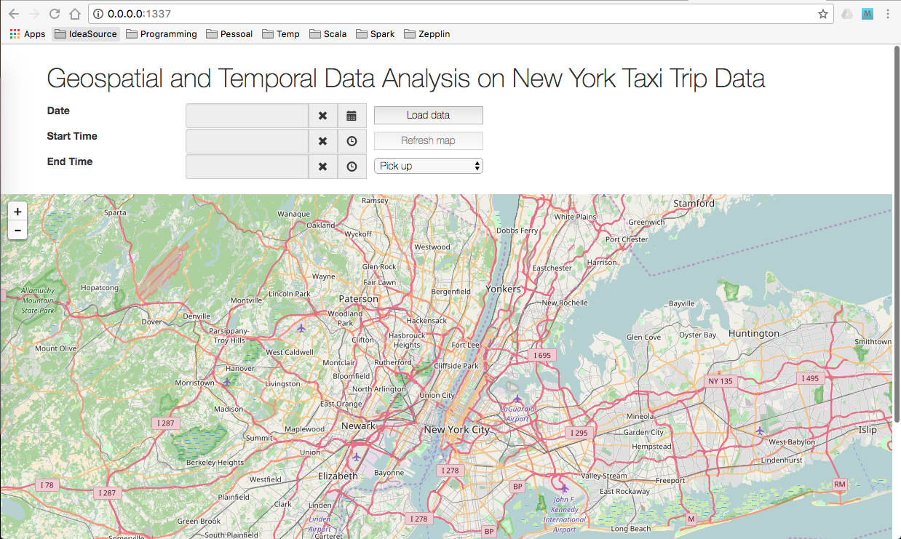

# AnalyticsWithApacheSpark
## Geospatial and Temporal Data Analysis on New York Taxi Trip Data 2015  
 This project analyzes the data from New York Taxi Trip data 2015.  
 You can get the data at [here](http://www.nyc.gov/html/tlc/html/about/trip_record_data.shtml).  
 You can get the dictionary of data [here](http://www.nyc.gov/html/tlc/downloads/pdf/data_dictionary_trip_records_yellow.pdf)..

## How to run  
 Clone the repository.  
 Download [Spark-Notebook](http://spark-notebook.io/).  
 Download [Apache Spark](https://spark.apache.org/).  
 You need to have Java installed.  
 Export the variables

```
export AAS_DATA_PATH=<path to the data directory>
export AAS_CSV_FILE_PATH=<path to csv file>
```

### Runing using Apache Spark
 You can start spark-shell from the directory you unpack Apache Spark
```
    spark-shell --driver-memory 8G
```
and copy/paste the code from **"spark/analysis.scala"** or you can run spark-shell passing the file
```
    spark-shell --driver-memory 8G -i spark/analysis.scala
```

### Runing using Spark-Notebook
 Start Spark-Notebook running from the directory you unpack spark-notebook
```
    bin/spark-notebook
```
Go to http://0.0.0.0:9001/  
Import the notebook from **"spark-notebook/Geospatial and Temporal Data Analysis on New York Taxi Trip Data.snb"**
Double click the notebook and run all the cells


### Visualize the data
 Go to www directory and run any http server, for example from Python
```
python -m http.server 1337 &
```
 Go to http://0.0.0.0:1337/
 Select the period described by the csv file and select the time
 